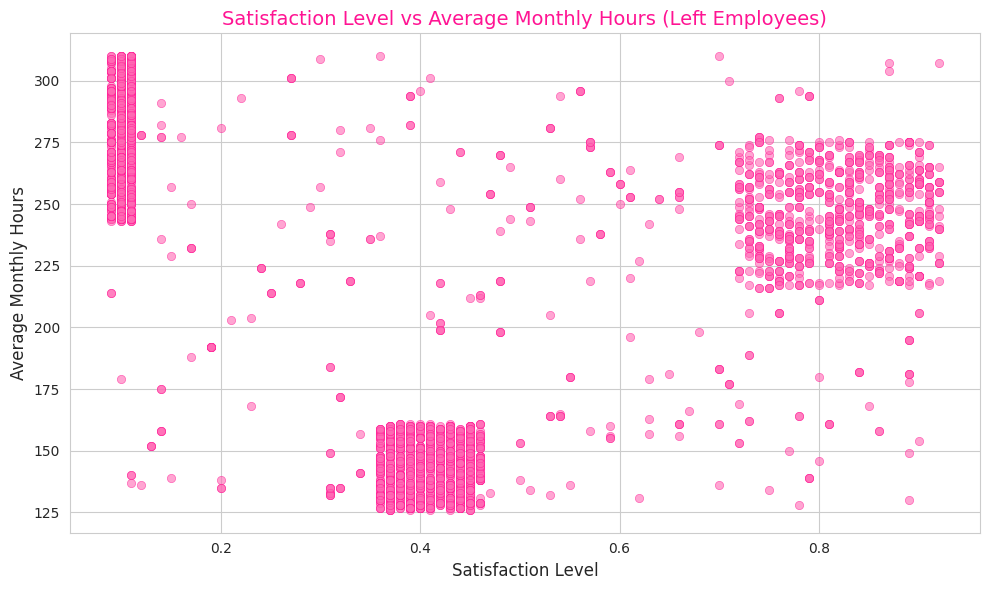

 <!-- Replace with your pastel pink banner -->

<h1 align="center" style="color:#e75480;">Machine Learning Project: Predicting Employee Attrition </h1>

---

## 🌟 Overview

In this project, I explored the delicate patterns behind employee attrition using Python and machine learning.

### 💡 Objectives
- Clean and preprocess real-world HR data
- Perform exploratory data analysis (EDA)
- Train a **Random Forest Classifier** to predict attrition
- Evaluate model performance with metrics like accuracy, confusion matrix & classification report
- Visualize feature importance to uncover what truly drives employees to leave

---

## 🧠 Tools & Technologies Used
- 🐍 Python
- 🧺 pandas
- 🎨 seaborn, matplotlib
- 🤖 scikit-learn

---

## 🧼 1. Data Cleaning & Preprocessing
- Handled missing values 
- Label-encoded categorical variables
- Split the dataset into training & testing sets

---

## 📊 2. Exploratory Data Analysis (EDA)
- Used colorful seaborn plots to explore relationships between:
  - Satisfaction levels
  - Work hours
  - Promotions
  - Department & attrition trends

---

## 🌲 3. Feature Selection & Model Training
- Trained a **Random Forest Classifier** for its interpretability and robustness
- Tuned hyperparameters for better accuracy

---

## 🧪 4. Model Evaluation
- Evaluated using:
  - ✅ Accuracy score
  - 📉 Confusion Matrix
  - 📝 Classification Report

---

## 🔍 5. Feature Importance Visualization
- Visualized key drivers behind attrition:
  - Low satisfaction
  - Workload stress
  - Lack of promotion

  

---

## 💕 Conclusion
This project helped me understand not just machine learning, but human behavior in workplaces.

---

## 🌈 Let's Connect!
> Made with Python
> If this helped you or made you smile, star ⭐ this repo or connect with me on [LinkedIn](https://www.linkedin.com/in/liya-s-chittilappilly)!

---

  
  

